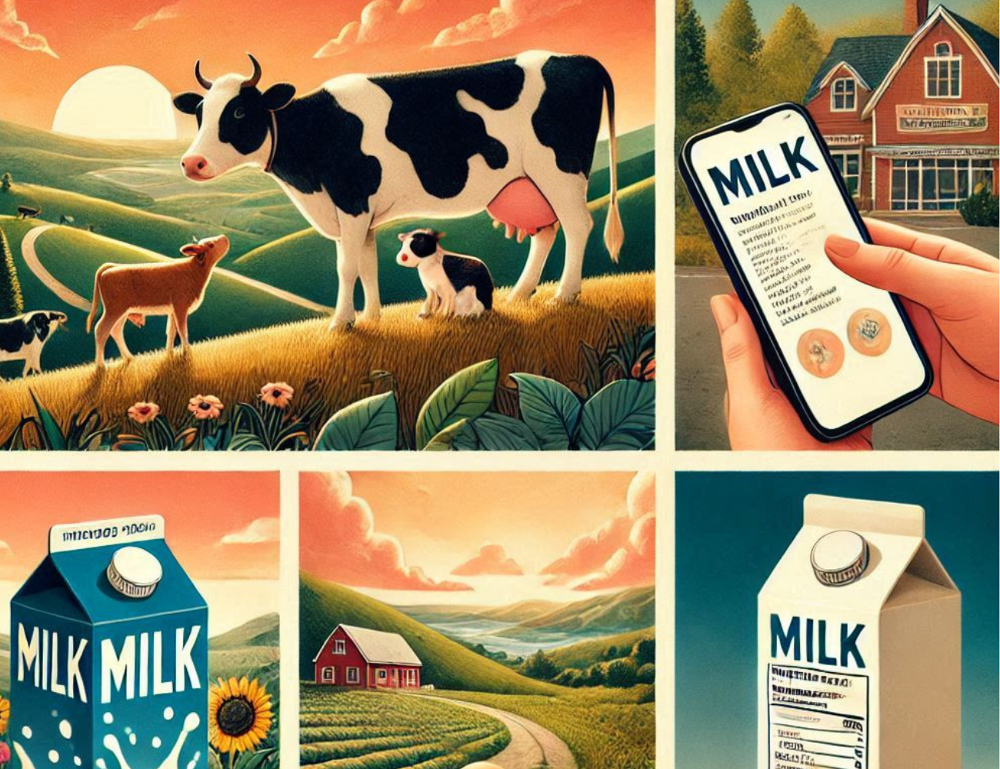

# A Comprehensive Analysis of Milk Production & Types


{ width=1000 height=640 }

<br>

## Welcome

Welcome to our website **Dairy Industry Insights**, your go-to source for the latest trends, research, and information on milk production in the US and milk types. We are a team of Biostatistics students from the Mailman School of Public health! To know more about us: <a href=About-us.html>go here</a> 


<br>

## Brief Introduction of our project

Dairy Industry Insights Project
Our project delves into the dairy industry, focusing on:

<ul> 
<li>Milking Cows and Production: We compiled data on milk production and cow numbers across various states.</li>

<li>Different Milk Types: We analyzed the production dynamics of whole milk, 2%, 1%, and skim milk, highlighting the trends.</li>

<li>Nutritional Analysis: We examined the nutritional content of various milk types, including cholosterol, fat and minerals, offering insights into their health benefits and dietary impacts.</li>
</ul>

<br>

## Screencast


<iframe width="800" height="420" src="https://www.youtube.com/embed/_lP3GGXQaPg?si=NGkNK4EqXNWY04Sb" title="YouTube video player" frameborder="0" allow="accelerometer; autoplay; clipboard-write; encrypted-media; gyroscope; picture-in-picture; web-share" allowfullscreen></iframe>

<br>

## Interactive World Map

<iframe src="https://ourworldindata.org/grapher/milk-production-tonnes?tab=map" loading="lazy" style="width: 100%; height: 600px; border: 0px none;" allow="web-share; clipboard-write"></iframe>

<br>

## Dairy Industry Insights Puzzle

```{r, results='asis', echo=FALSE}
htmltools::HTML('
<!DOCTYPE html>
<html>
<head>
  <title>Dairy Animal Puzzle</title>
  <style>
    body {
      font-family: Arial, sans-serif;
    }
    table {
      border-collapse: collapse;
      margin: 20px 0;
      font-size: 18px;
    }
    table, th, td {
      border: 1px solid black;
    }
    th, td {
      padding: 10px;
      text-align: center;
    }
    .found {
      background-color: yellow;
    }
  </style>
  <script>
    // Function to generate a random letter
    function randomLetter() {
      const letters = "ABCDEFGHIJKLMNOPQRSTUVWXYZ";
      return letters.charAt(Math.floor(Math.random() * letters.length));
    }

    // Dairy animals to be found
    const dairyAnimals = ["COW", "GOAT", "BUFFALO", "SHEEP", "YAK", "CAMEL", "REINDEER"];
    const selectedAnimal = dairyAnimals[Math.floor(Math.random() * dairyAnimals.length)];

    // Initialize puzzle grid
    const grid = Array.from({ length: 6 }, () => Array(20).fill(""));
    
    // Function to place the selected animal in the grid
    function placeWord(word) {
      const length = word.length;
      let placed = false;

      while (!placed) {
        const direction = Math.floor(Math.random() * 2);
        const row = Math.floor(Math.random() * (6 - (direction === 0 ? length : 1)));
        const col = Math.floor(Math.random() * (20 - (direction === 1 ? length : 1)));
        
        let fits = true;
        
        for (let i = 0; i < length; i++) {
          const newRow = row + (direction === 0 ? i : 0);
          const newCol = col + (direction === 1 ? i : 0);
          
          if (grid[newRow][newCol] && grid[newRow][newCol] !== word[i]) {
            fits = false;
            break;
          }
        }
        
        if (fits) {
          for (let i = 0; i < length; i++) {
            const newRow = row + (direction === 0 ? i : 0);
            const newCol = col + (direction === 1 ? i : 0);
            
            grid[newRow][newCol] = word[i];
          }
          placed = true;
        }
      }
    }

    // Place the selected animal in the grid
    placeWord(selectedAnimal);

    // Fill remaining cells with random letters
    for (let i = 0; i < 6; i++) {
      for (let j = 0; j < 20; j++) {
        if (!grid[i][j]) {
          grid[i][j] = randomLetter();
        }
      }
    }

    // Function to create puzzle table
    function createPuzzleTable() {
      const table = document.createElement("table");
      for (let i = 0; i < 6; i++) {
        const row = table.insertRow();
        for (let j = 0; j < 20; j++) {
          const cell = row.insertCell();
          cell.innerText = grid[i][j];
        }
      }
      return table;
    }

    // Function to check word
    function findWord() {
      const input = document.getElementById("wordInput").value.toUpperCase();
      const cells = document.querySelectorAll("td");
      let found = false;
      const directions = [
        [0, 1], // Horizontal
        [1, 0]  // Vertical
      ];

      for (const direction of directions) {
        if (selectedAnimal === input) {
          cells.forEach((cell, index) => {
            const row = Math.floor(index / 20);
            const col = index % 20;
            if (checkWordInGrid(row, col, selectedAnimal, direction)) {
              for (let i = 0; i < selectedAnimal.length; i++) {
                const newRow = row + direction[0] * i;
                const newCol = col + direction[1] * i;
                cells[newRow * 20 + newCol].classList.add("found");
              }
              found = true;
            }
          });
        }
      }

      if (found) {
        alert("Word Found!");
      } else {
        alert(`Word Not Found! The correct word was: ${selectedAnimal}`);
      }

      // Disable the input field and button after one attempt
      document.getElementById("wordInput").disabled = true;
      document.querySelector("button").disabled = true;
    }

    function checkWordInGrid(row, col, word, direction) {
      for (let i = 0; i < word.length; i++) {
        const newRow = row + direction[0] * i;
        const newCol = col + direction[1] * i;
        if (grid[newRow] && grid[newRow][newCol] !== word[i]) {
          return false;
        }
      }
      return true;
    }

    // Create and display puzzle table on page load
    document.addEventListener("DOMContentLoaded", () => {
      document.getElementById("puzzleContainer").appendChild(createPuzzleTable());
    });
  </script>
</head>
<body>
  <p>Thank you so much for visiting our website! Here is a fun activity! One dairy animal is hidden here- find it! <br>
  (Refresh site for new puzzle):</p>
  <div id="puzzleContainer"></div>
  <input type="text" id="wordInput" placeholder="Enter word">
  <button onclick="findWord()">Find</button>
</body>
</html>
')

```

