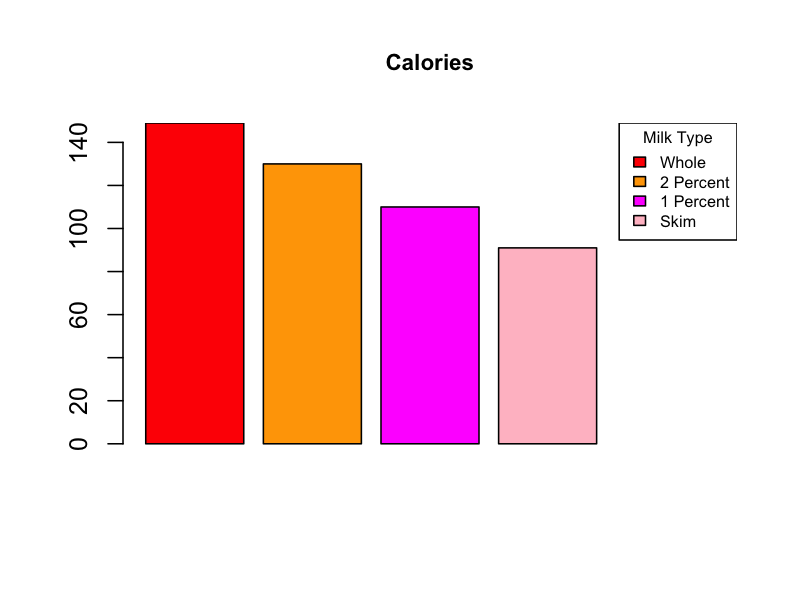
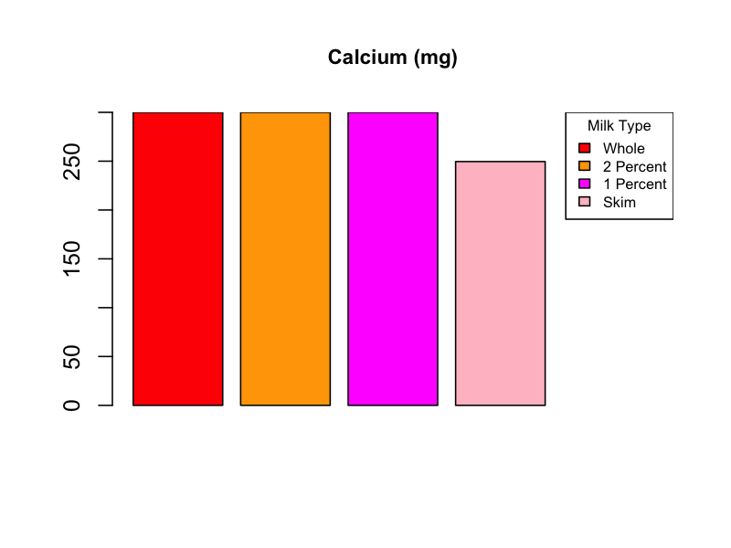
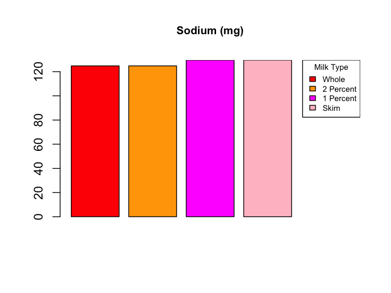

```{r setup, include=FALSE}
#loading required libraries
library(tidyverse)
library(readxl)
library(gridExtra)
library(knitr)
library(kableExtra)
library(plotly)
```

<br>

We’ve talked extensively about the four main types of milk—whole, 2%, 1%, and skim—in the previous section. But what really makes them different from each other? It mostly comes down to their nutrients. Sure, taste, availability, and other factors also matter, but it's really the nutrients that set them apart and explain why we have four different types instead of just one. Here, we will analyse these four types from a health/nutrition perspective and see if we can comment on the sales based on the data we have.
<br>
<h3> Introductory Analysis </h3>
<br>
```{R, echo= FALSE}
#creating data frame; cleaning accordingly; doing some analysis
df <- readxl::read_xlsx('nutri.xlsx')|>
  head(11)
nutri <- df |>
  as.data.frame() |>
  mutate(Whole = as.double(Whole))
nutri_d <- nutri |>
  mutate(mean_diff = rowMeans(across(c(Whole, `2 Percent`, `1 Percent`))) -Skim) |>
  select(c(1,6)) |>
  filter(mean_diff != 0)
colnames(nutri_d)[2] <- "Mean Difference"
nutri_same <- nutri |>
  mutate(mean_diff = rowMeans(across(c(Whole, `2 Percent`, `1 Percent`))) -Skim) |>
  filter(mean_diff == 0) |>
  select(1,3)
colnames(nutri_same)[2] <- "All 4 Milk Types"
kable(nutri_same, format = "html") |>
  kable_styling(bootstrap_options = "striped", full_width = TRUE) |>
  add_header_above(c("Nutritional Components Same Across Milk Types" = ncol(nutri_same)), bold = TRUE, align = "c", background = "pink") |>
  row_spec(0, bold = TRUE)

```

The above table provides us with nutritional components that are the same for all four types of milk.

To analyse nutritional differences in milk types, we will subtract the values for skim milk from the mean of the other milk types. If the result is not zero, it indicates a difference. Since skim milk has the least fat, it and whole milk will have extreme values, meaning the mean of the others won't match skim milk.

```{R, echo = FALSE}
#making table
kable(nutri_d, format = "html") |>
  kable_styling(full_width = TRUE, bootstrap_options = "bordered") |>
  add_header_above(c("Nutritional Components Different Across Milk Types" = ncol(nutri_d)), bold = TRUE, align = "c", background = "pink") |>
  row_spec(0, bold = TRUE)
```

While the table identifies which components differ, it only indicates where to analyze further. Visualizing these differences with bar plots will provide more insightful and intuitive comparisons.

```{r, echo=FALSE, message=FALSE, warning=FALSE}
#making plots for nutritional components that have different values
extra <- c(0, 0, 0, 0)
selected_rows <- nutri[c(1, 3, 5, 11), ]
nutri_bp <- cbind(selected_rows, extra)
rows_to_plot <- c(1, 2, 3, 4)
legend_labels <- names(nutri_bp)[2:(ncol(nutri_bp) - 1)]
bc <- c("red", "orange", "magenta", "pink", "transparent")

for (i in rows_to_plot) {
  values <- as.numeric(nutri_bp[i, 2:ncol(nutri_bp)])
  plot_title <- as.character(nutri_bp[i, 1])
  png(filename = paste0("plot_", i, ".png"), width = 800, height = 600, res = 150)
  bar_pos <- barplot(values, main = plot_title, col = bc, border = NA, cex.main = 0.9)
  for (j in seq_along(values)) { 
    if (values[j] != 0) { 
      rect(bar_pos[j] - 0.5, 0, bar_pos[j] + 0.5, values[j], border = "black")
    }
  }
  legend("topright", legend = legend_labels, fill = bc[-length(bc)], title = "Milk Type", cex = 0.65)
}
```

<h3> <b> <center> Bar Plots for Nutritional Components with Different Values Across Milk Types </center> </b> </h3>

```{r, results='asis', echo=FALSE}
#code for slideshow for the 4 plots
htmltools::HTML('
<div class="slideshow-container">

    <div class="slides">
        
    </div>

    <div class="slides">
        
    </div>

    <div class="slides">
        
    </div>

    <div class="slides">
        
    </div>

    <a class="prev" onclick="plusSlides(-1)">&#10094;</a>
    <a class="next" onclick="plusSlides(1)">&#10095;</a>
</div>

<style>
    .slideshow-container {
        max-width: 100%;
        position: relative;
        margin: auto;
    }
    .slides {
        display: none;
    }
    .prev, .next {
        cursor: pointer;
        position: absolute;
        top: 50%;
        width: auto;
        padding: 16px;
        color: white;
        font-weight: bold;
        font-size: 48px; /* Increased font size */
        transition: 0.6s ease;
        border-radius: 0 3px 3px 0;
        user-select: none;
        transform: translateY(-50%);
        z-index: 2; /* Ensure arrows are on top of other elements */
        background-color: rgba(0,0,0,0.5); /* Adding background for better visibility */
    }
    .next {
        right: 10px; /* Adjusted to prevent overlap with edge */
        border-radius: 3px 0 0 3px;
    }
    .prev {
        left: 10px; /* Adjusted to prevent overlap with edge */
        border-radius: 3px 0 0 3px;
    }
    .prev:hover, .next:hover {
        background-color: rgba(0,0,0,0.8);
    }
</style>

<script>
let slideIndex = 1;
showSlides(slideIndex);

function plusSlides(n) {
    showSlides(slideIndex += n);
}

function showSlides(n) {
    let i;
    let slides = document.getElementsByClassName("slides");
    if (n > slides.length) {slideIndex = 1}
    if (n < 1) {slideIndex = slides.length}
    for (i = 0; i < slides.length; i++) {
        slides[i].style.display = "none";
    }
    slides[slideIndex-1].style.display = "block";
}
</script>
')
```

There is a decreasing trend as we go towards the lower fat options for calories and cholesterol.
Quantity of sodium is roughly the same for all 4 (higher in 1% and skim).
Skim has the least amount of calcium. The rest seem to have the same amount.
<br><br>
<h3> Pie Charts for Cholesterol </h3>
<br><br>
```{R, echo= FALSE}
# Making a layout
layout(matrix(c(1, 1, 2, 3, 4, 5), nrow=3, ncol=2, byrow=TRUE), heights=c(0.2, 1, 1))
par(mar=c(0, 0, 2, 0)) # Adjust margins for the title
plot.new()
title(main="Cholesterol Intake /cup for a 2000 calorie diet", cex.main=2, font.main=2)
percentages <- c(12, 6, 5, 2)
titles <- c("Whole Milk", "2% Milk", "1% Milk", "Skim Milk")
colors <- c("coral", "#ffe2e6")

par(mar=c(4, 4, 2, 2)) # Adjusting margins

#Pie charts
for (i in 1:4) { pie(c(percentages[i], 100 - percentages[i]), labels = c("", ""), col = colors, main = titles[i], cex = 1.5)}
```

The above pie charts show the cholesterol intake per cup for a 2000 calorie diet. Obviously, higher fat means more cholesterol. This intake is quite important as a health conscious person is likely to lean towards the lower fat options because of the lower cholesterol. Accompany the individual cholesterol with the fact that most people will use milk in some way and not just drink it straight up implies that the way they consume it (through cereal or drinks) would increase their cholesterol intake due to what they added.

<br>
<h3> Comparing the Fat Content Across all Four Types </h3>
<br>
```{R, echo= FALSE}
#making plots for fat for all 4 types
data1 <- data.frame(
  Variable = factor(titles, levels = titles),  
  Percentage = c(10, 6, 3, 0) #as seen in excel file; only 4 values hence directly used
)

data2 <- data.frame(
  Variable = factor(titles, levels = titles),  
  Percentage = c(25, 15, 7, 0)
)

colors <- c("Whole Milk" = "red", "2% Milk" = "orange", "1% Milk" = "magenta", "Skim Milk" = "pink")

empty_plot <- ggplot() + theme_void()

plot1 <- ggplot(data1, aes(x = Variable, y = Percentage, fill = Variable)) +
  geom_bar(stat = "identity") +
  scale_fill_manual(values = colors) +
  scale_y_continuous(limits = c(0, 30), breaks = seq(0, 28, by = 4)) +
  theme_minimal() +
  labs(title = "Total Fat", x = "", y = "% of Daily Value for 2000 Cal. Diet") +
  theme(plot.title = element_text(hjust = 0.5),axis.text.x = element_blank(), legend.position = "none")

plot2 <- ggplot(data2, aes(x = Variable, y = Percentage, fill = Variable)) +
  geom_bar(stat = "identity") +
  scale_fill_manual(values = colors) +
  scale_y_continuous(limits = c(0, 30), breaks = seq(0, 28, by = 4)) +
  theme_minimal() +
  labs(title = "Saturated Fat", x = "", y = "") +
  theme(plot.title = element_text(hjust = 0.5), axis.text.x = element_blank(), legend.position = "none")

#Making a single legend because the 4 types are common for both plots
get_legend <- function(myplot) {
  tmp <- ggplot_gtable(ggplot_build(myplot))
  leg <- which(sapply(tmp$grobs, function(x) x$name) == "guide-box")
  legend <- tmp$grobs[[leg]]
  return(legend)
}

legend <- get_legend(ggplot(data1, aes(x = Variable, y = Percentage, fill = Variable)) +
                       geom_bar(stat = "identity") +
                       scale_fill_manual(values = colors) +
                       theme_minimal() +
                       labs(fill = "Milk Type"))
grid.arrange(empty_plot, plot1, plot2, legend, ncol = 4, widths = c(1, 2, 2, 1.5))
```

The fat content decreases progressively from Whole Milk to 2% Milk, 1% Milk, and Skim Milk, reflecting their names (Fun Fact: Whole Milk has a little over 3% fat). The bar plots above effectively illustrate this reduction. For instance, a 1% decrease indicates that our total and saturated fat intake is halved when transitioning from Whole to 2% Milk, and further reduced from 2% to 1%, ultimately reaching zero in Skim Milk.
<br>
<h3> Regression Analysis </h3>
<br>
We will now perform a regression analysis on the five most recent sales ratios of the four types of milk (more about the ratios is [here](milktypes_trends.html) with their respective Cholesterol and Saturated Fat content. This analysis aims to determine if consumers have become more health-conscious over the years.

```{R, echo = FALSE,message=FALSE, warning=FALSE}
#transferring the ANOVA results for all 4 Milk types here
fluidmilk <- read_excel("fluidmilk.xlsx", sheet = "fluidmilk", skip = 1)

colnames(fluidmilk) <- c(
  "Year", "Whole", "ReducedFat2", "LowFat1", "Skim",
  "FlavoredWhole", "FlavoredOther", "Buttermilk", "Eggnog", "Total"
)


fluidmilk_clean <- fluidmilk %>%
  mutate(across(Whole:Total, as.numeric)) %>%
  filter(!is.na(Year)) %>%
  arrange(Year)


fluidmilk_ratios <- fluidmilk_clean %>%
  mutate(
    WholeRatio = Whole / lag(Whole),
    ReducedFat2Ratio = ReducedFat2 / lag(ReducedFat2),
    LowFat1Ratio = LowFat1 / lag(LowFat1),
    SkimRatio = Skim / lag(Skim)
  )


recent_ratios <- fluidmilk_ratios %>%
  filter(!is.na(WholeRatio) & !is.na(ReducedFat2Ratio) &
           !is.na(LowFat1Ratio) & !is.na(SkimRatio)) %>%
  select(Year, WholeRatio, ReducedFat2Ratio, LowFat1Ratio, SkimRatio) %>%
  tail(5)


# Transform to long format
df_long <- recent_ratios |>
  rename('Whole' = WholeRatio,
         '1 Percent' = ReducedFat2Ratio,
         '2 Percent' = LowFat1Ratio,
         'Skim' = SkimRatio) |>
  pivot_longer(cols = c('Whole', '2 Percent' , '1 Percent', 'Skim'),
               names_to = "Milk_Type",
               values_to = "Sales_Ratio")

# Data frame with cholesterol and saturated fat values - values entered directly instead of reading from excel as it is just 4 values and hence easier to directly enter
df_health <- data.frame(
  'Milk_Type' = c('Whole', '2 Percent' , '1 Percent', 'Skim'),
  'Cholesterol_mg'= c(36, 19.2, 14.4, 4.8),
  'SaturatedFat_g' = c(4.992, 3, 1.488, 0)
)

# Merge sales ratios with health data
df_merged <- left_join(df_long, df_health, by = "Milk_Type")
df_merged <- df_merged |> 
  mutate(Milk_Type = factor(Milk_Type, levels = c("Whole", "2 Percent", "1 Percent", "Skim")))

#Regression model
model <- lm(Sales_Ratio ~ Year + Cholesterol_mg + SaturatedFat_g, data = df_merged)
model2 <- lm(Sales_Ratio ~ Year + SaturatedFat_g, data = df_merged)

# Tidy the model results
tidy_model <- broom::tidy(model)

# Rename the terms
tidy_model <- tidy_model |>
  mutate(term = recode(term,
                       `(Intercept)` = "Intercept",
                       `Year2020` = "Year 2020",
                       `Year2021` = "Year 2021",
                       `Year2022` = "Year 2022",
                       `Year2023` = "Year 2023",
                       `Cholesterol_mg` = "Cholesterol (mg)",
                       `SaturatedFat_g` = "Saturated Fat (g)"))

# Displaying using kable
tidy_model |>
  kable(format = "html") |>
  kable_styling(bootstrap_options = "striped", full_width = TRUE) |>
  add_header_above(c("Regression Model Summary" = ncol(tidy_model)), bold = TRUE, align = "c", background = "pink") |>
  row_spec(0, bold = TRUE)


```

<b>Cholesterol</b>: 

This positive coefficient, 0.006719714, suggests that higher cholesterol content is associated with a higher Sales Ratio. However, this relationship is not statistically significant (p-value 0.1041602).

<b>Saturated Fat</b>: 

This negative coefficient, -0.021363109, indicates that higher saturated fat is associated with a lower Sales Ratio, but again, this is not statistically significant (p-value 0.3802799).

Based on this regression analysis, there is no strong or significant evidence to suggest that people have become more health-conscious over the years based on changes in sales ratios of milk types associated with cholesterol and saturated fat content.

It is common knowledge that as we go from Skim to 1% and eventually to Whole we are increasing our fat intake. Saturated fat is not considered a good type of Fat (a topic of debate). Based on our previous results, we saw that higher saturated fat is associated with a lower Sales Ratio but not statistically significant. Here is a plot with Saturated Fat as a predictor for Sales Ratio to better understand our result.

```{R, echo = FALSE, warning = FALSE}
# Predicted vs Actual Sales Ratio
df_merged$Predicted <- predict(model2)

plotpr <- ggplot(df_merged, aes(x = Sales_Ratio, y = Predicted, color = Milk_Type)) +
  geom_point(size = 2, aes(text = paste("Year:", Year, "<br>", "Actual:", Sales_Ratio, "<br>", "Predicted:", Predicted))) +
  geom_abline(intercept = 0, slope = 1, linetype = "dashed") +
  scale_color_manual(values = c("Whole" = "red", "2 Percent" = "orange", "1 Percent" = "magenta", "Skim" = "pink")) +
  labs(title = "Actual vs Predicted (from Saturated Fat) Sales Ratio", x = "Actual Sales Ratio", y = "Predicted Sales Ratio", color = "Milk Type")

ggplotly(plotpr, tooltip = c("text"))
```

<b> Conclusions based on above plot and ANOVA results </b>
<ul>
 <li> Saturated fat and Sales: For the Skim and 2%, most of the points lie above the dashed line. This suggests that the model tends to overestimate the sales ratios for these milk types.<br>
For Whole and 1% Milk, most of the points lie below the dashed line. This indicates that the model tends to underestimate the sales ratios for these milk types.<br>
This shows why, for the current model, Saturated Fat is not a good predictor. Although it has a negative association according to our ANOVA results, it did something unexpected: it overestimated for 2% but underestimated for 1%.
 </li>
 <li>Bias in Predictions: The model tends to overestimate sales ratios for certain milk types and underestimate them for others, indicating that other factors might be at play which are not accounted for by just using saturated fat as a predictor.
 </li>
 <li>Further Analysis Needed: To improve the model, it might be beneficial to include additional predictors such as price, marketing efforts, consumer preferences, or other nutritional information. Consumer preferences and dietary requirements is a crucial factor because someone may prefer taste of one over the other. It is also possible that their diet doesn't contain a lot of fat and hence, they need whole milk, for instance.
 </li>
</ul>
